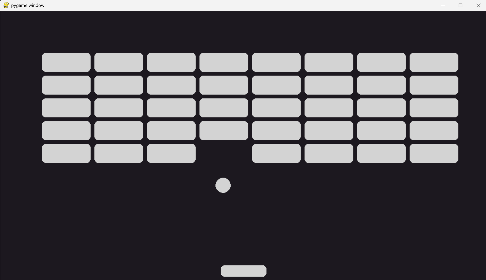

# Breakout
First time making games with python. Made for Hackclub. Initially was supposed to make pong but decided Breakout would be more fun and challenging

# How to use
Just run the python file "Breakout.py" and play!

# How it was made
Codeded in pyhton. Used the library Pygame.

# Note:
Please let me know if there are any bugs.

Royalty-free music track "Pixel" was made by Robloxeur and obtained through "pixabay". Find it here
"https://pixabay.com/music/video-games-pixel-245147/"

Pixel Text was made with TextStudios. Find it here
"https://www.textstudio.com/logo/831/pixel"
